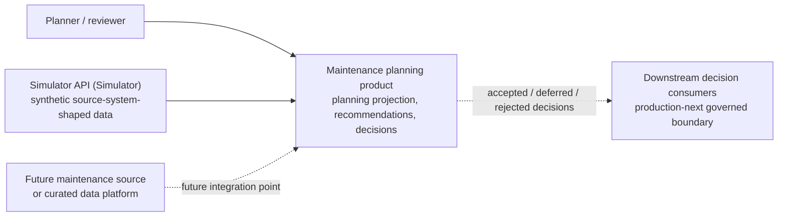
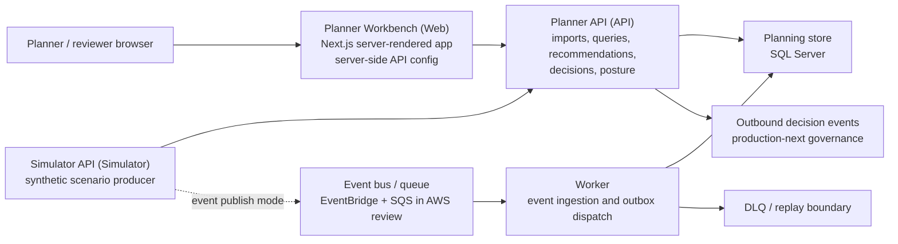
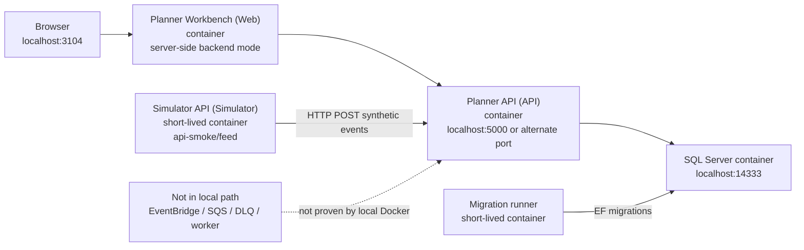
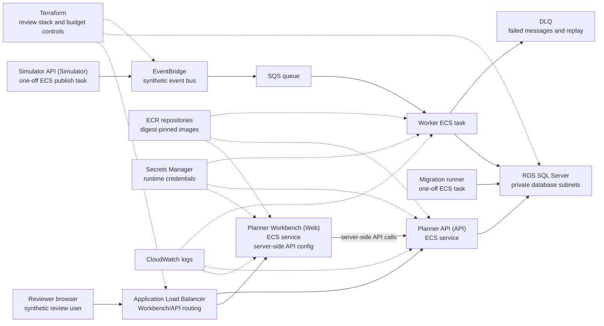
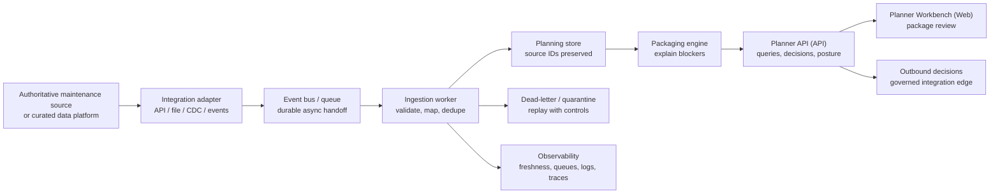
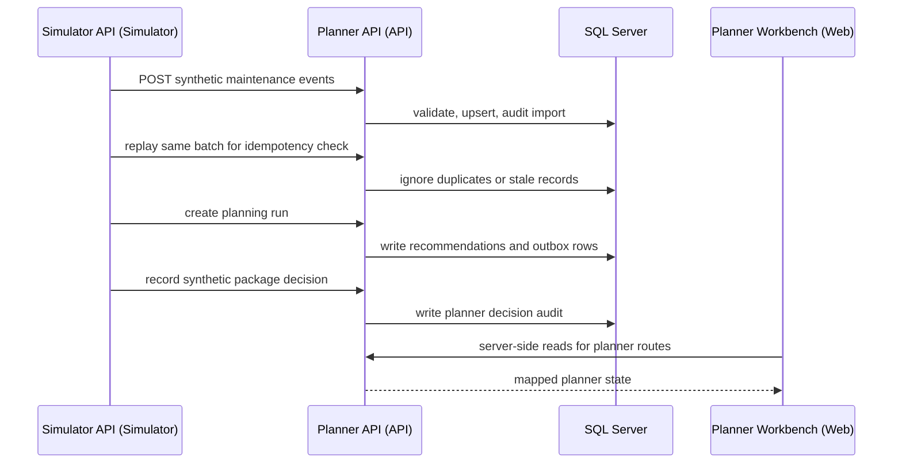

# Solution Architecture

This page describes the synthetic maintenance-planning prototype from a solution architecture point of view. It covers the three public repositories, their runtime boundaries and the difference between local Docker, AWS review and production-next shapes.

## Boundary

- The prototype uses synthetic data only.
- It does not connect to any employer, client or production source system.
- It does not claim production support, high availability, formal assurance or operational ownership.
- The AWS review shape is defined as infrastructure and scripts, but live deployment evidence is separate from this document.
- The web backend URL and API token are server-side runtime settings. They must not be exposed through browser-visible variables.

## Canonical Names

Use these names consistently across diagrams and documentation.

| Name | Repository | Responsibility |
| --- | --- | --- |
| Planner Workbench (Web) | `maintenance-planning-web` | Planner-facing Next.js workbench. It presents planner workflows over mock data by default or over server-side API calls when backend mode is configured. |
| Planner API (API) | `maintenance-planning-api` | Backend-authoritative .NET API for imports, planning runs, recommendations, planner decisions, operations posture and protected operations routes. |
| Simulator API (Simulator) | `maintenance-data-simulator` | Deterministic synthetic scenario producer for local HTTP feed checks and explicit EventBridge publish checks. |
| Worker | `maintenance-planning-api` | Event ingestion and outbox dispatch worker for the asynchronous review path. |
| Planning store | `maintenance-planning-api` | SQL Server persistence for planning projections, imports, audit, recommendations, planner decisions and outbox records. |

## System Context

The simulator supplies synthetic data for review. A production-next version would replace the simulator in the main flow with a governed integration from an authoritative maintenance source or curated data platform.

## Logical Container View

The API owns planning truth. The workbench presents planner-facing state. The simulator produces deterministic synthetic events. The worker and queue path represent the asynchronous review architecture and must be verified separately from the local HTTP path.

## Local Docker Architecture

The local Docker system is the fast end-to-end path for the prototype. It proves local image packaging, explicit migrations, HTTP import, SQL persistence, recommendations, decisions, operations posture and backend-mode web rendering.

Local Docker does not prove EventBridge delivery, SQS worker ingestion, DLQ replay, registry digest promotion, Terraform deployment or live review endpoints.

For commands, see [Local Docker system runbook](local-docker-system.md).

## AWS Review Architecture

The AWS review architecture is a cost-controlled prototype deployment shape. It is intended to resemble production boundaries without claiming production support.

AWS review evidence requires a live run before it is described as exercised:

- images pushed with immutable digests;
- Terraform reviewed and applied with budget controls and teardown expectations;
- migrations run through the migration task;
- Planner API health, readiness and OpenAPI checked through the review endpoint;
- Planner Workbench liveness and planner routes checked through the review endpoint;
- Simulator API publishes synthetic events to EventBridge;
- EventBridge delivers to SQS;
- worker consumption into SQL Server projections is verified;
- queue depth, dead-letter posture and replay behaviour are checked only when safe.

For infrastructure details, see [AWS and Terraform](aws-terraform.md) and [Migration release gate](release-gate.md).

## Production-Next Target

Production-next is a conceptual operating model. It is not current evidence.

Production-next principles:

- the authoritative maintenance source remains the source of truth for execution data;
- the planning product owns an auditable planning projection;
- source identifiers, source timestamps, idempotency keys and import audit are preserved;
- invalid, stale or conflicting records are rejected or quarantined with review detail;
- Planner API remains backend-authoritative for recommendations and planner decisions;
- Planner Workbench presents planner review workflows over API-owned truth;
- outbound decision events require governance before they affect downstream systems.

For gap details, see [Production-next](production-next.md).

## Local HTTP Feed Flow

## Evidence Status

| Area | Status |
| --- | --- |
| Local Docker HTTP and SQL path | Proven by local smoke evidence. |
| Planner API contracts and operations posture | Implemented for review. |
| Planner Workbench backend mode | Implemented with server-side API configuration. |
| AWS infrastructure shape | Defined, but live evidence requires an applied review stack and smoke checks. |
| EventBridge, SQS and worker ingestion | Not proven until the live AWS event path is smoked. |
| Production-next architecture | Conceptual target only. |
